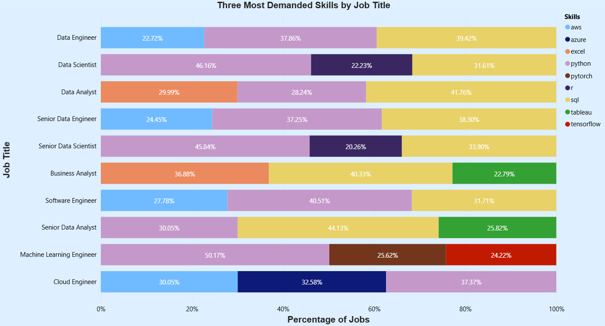
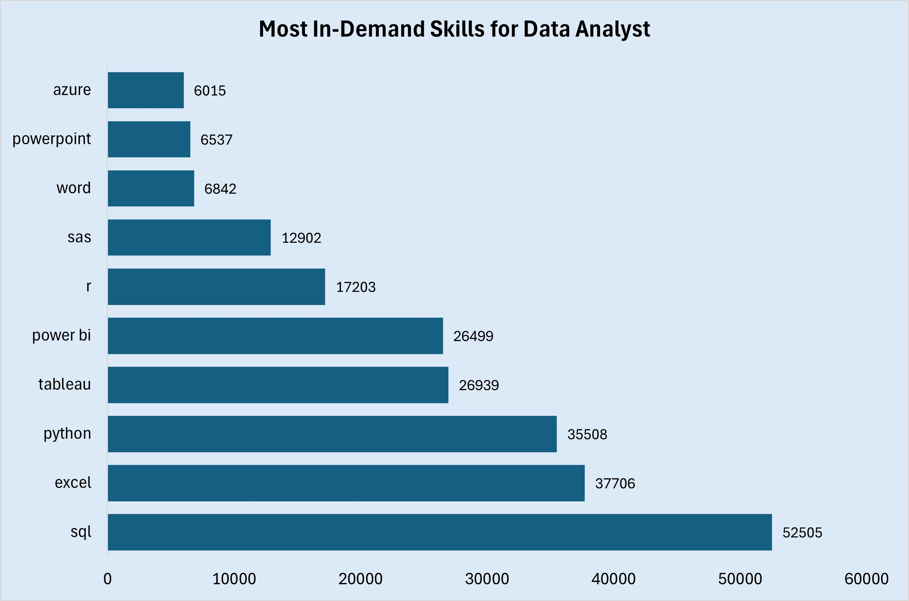

# SQL-Data-Jobs-Market-Insights
## Introduction
This project explores job postings data using SQL. The dataset contains job information, company details, and associated skills. The goal was to perform both general job market analysis and focused role-specific analysis (e.g., Data Analyst) to uncover insights about salaries, skills, and hiring trends.

[View the SQL Queries](Data_Jobs_Analysis.sql)
## Background
The job market is highly competitive, and understanding demand, salaries, and skills is crucial for job seekers and organizations.
This dataset provides structured information such as:
- Job titles and locations
- Salaries (annual/hourly)
- Work from home and health insurance flags
- Required skills for each job
- Company information

By analyzing this data, we can identify high-paying roles, in-demand skills, and hiring patterns across different companies and job titles.
## Tools I Used
- PostgreSQL → to query and analyze the dataset
- DBMS ERD → to understand table relationships
- SQL Window Functions → for ranking and advanced calculations
- GitHub → to document and share the project
## Entity Relationship Diagram (ERD)
The project database consists of four main tables connected through keys:
- company_dim – Stores company details (company name, links, logos).
- job_postings_fact – Fact table containing job postings with salary, location, work type, etc.
- skills_job_dim – Bridge table linking job postings to required skills.
- skills_dim – Dimension table with details about each skill and its type (e.g., programming, tools).

Relationships:
- Each company (company_dim) can have multiple job postings (job_postings_fact).
- Each job posting can require multiple skills (skills_job_dim).
- Each skill (skills_dim) can be associated with multiple job postings.

[Click here for ERD](Assets/ERD.png)
## The Analysis
The analysis focused on understanding job market trends. Using SQL, I examined the volume of job postings, average salaries by job title, most active hiring companies, and the prevalence of remote work opportunities. I also explored the demand for technical and analytical skills by aggregating skill frequencies across job postings. This provided a clear picture of which roles are in high demand, which skills are most valued, and how salaries vary by company, work type etc.
### 1. What is the job count & average yearly salary for each job_title_short?
```sql
select 
	job_title_short,
	count(job_id) as total_jobs,
	round(avg(salary_year_avg), 0) as avg_salary
from job_postings_fact
where salary_year_avg is not null
group by job_title_short
order by avg_salary desc;
```
- Senior-level roles such as Senior Data Scientist and Senior Data Engineer earn the highest salaries, both above $150K.
- Data Scientist and Data Engineer roles are highly demanded (3,600–5,000+ postings) with strong six-figure salaries (~$132K).
- Data Analyst positions dominate in volume (6,227 jobs) but have the lowest average salary (~$92K).
- Overall, advanced technical roles (ML, Data Science, Engineering) provide higher pay, while analyst roles offer more opportunities but lower compensation.
 

| Job Title              | Total Jobs | Avg. Salary (USD) |
|------------------------|------------|-------------------|
| Senior Data Scientist  | 1,259      | 155,914           |
| Senior Data Engineer   | 1,128      | 151,373           |
| Machine Learning Engr  | 429        | 151,355           |
| Software Engineer      | 643        | 140,287           |
| Data Engineer          | 3,643      | 132,521           |
| Data Scientist         | 5,065      | 132,483           |
| Cloud Engineer         | 61         | 124,932           |
| Senior Data Analyst    | 936        | 111,888           |
| Business Analyst       | 944        | 97,561            |
| Data Analyst           | 6,227      | 91,814            |

*Job Market Overview by Roles*
### 2. Show the top 10 skills most frequently required across all jobs.
```sql
select 
	sd.skills,
	count(jpf.job_id) as demand_count
from job_postings_fact jpf
	join skills_job_dim sjd on jpf.job_id = sjd.job_id
	join skills_dim sd on sjd.skill_id = sd.skill_id
group by sd.skills
order by demand_count desc
limit 10;
```
- Python and SQL dominate the market with demand counts over 240K, making them the most essential skills.
- Cloud skills like AWS and Azure show strong demand (~100K each), highlighting the rise of cloud technologies.
- Visualization tools such as Tableau and Power BI are also highly requested (~65K–73K).
- Traditional tools like Excel and statistical languages like R remain consistently valuable.
 

| Skill     | Demand Count |
|-----------|--------------|
| Python    | 244,416      |
| SQL       | 240,179      |
| AWS       | 100,386      |
| Azure     | 93,849       |
| Tableau   | 73,560       |
| Spark     | 71,979       |
| R         | 71,835       |
| Excel     | 71,807       |
| Power BI  | 66,183       |
| Java      | 51,294       |

*Most Requested Technical Skills*
### 3. Compare the average salary of remote vs non-remote jobs for each job_title_short.
```sql
select 
	job_title_short,
	round(avg(case when job_work_from_home = true then salary_year_avg end), 0)
	as avg_remote_salary,
	round(avg(case when job_work_from_home = false then salary_year_avg end), 0)
	as avg_nonremote_salary,
	count(case when job_work_from_home = true then job_id end) as remote_job_count,
	count(case when job_work_from_home = false then job_id end) as nonremote_job_count
from job_postings_fact
where salary_year_avg is not null
group by job_title_short
order by job_title_short;
```
- Senior roles (Senior Data Engineer, Senior Data Scientist) earn noticeably higher salaries in remote positions compared to non-remote.
- Software Engineers show one of the largest gaps: remote salaries (~$163K) are much higher than non-remote (~$129K).
- Data Analyst jobs are abundant in non-remote positions (5,751 vs. 476 remote), and salaries are slightly lower for remote.
- Overall, remote roles tend to pay more, especially in technical and senior positions, but they are fewer in number.
  

| Job Title              | Avg Remote Salary | Avg Non-Remote Salary | Remote Jobs | Non-Remote Jobs |
|------------------------|-------------------|-----------------------|-------------|-----------------|
| Business Analyst       | 97,224            | 97,684                | 251         | 693             |
| Cloud Engineer         | 139,033           | 116,397               | 23          | 38              |
| Data Analyst           | 89,939            | 91,969                | 476         | 5,751           |
| Data Engineer          | 134,529           | 131,832               | 931         | 2,712           |
| Data Scientist         | 133,948           | 132,049               | 1,157       | 3,908           |
| Machine Learning Engr  | 154,817           | 149,475               | 151         | 278             |
| Senior Data Analyst    | 103,602           | 113,520               | 154         | 782             |
| Senior Data Engineer   | 171,057           | 144,904               | 279         | 849             |
| Senior Data Scientist  | 160,128           | 154,758               | 271         | 988             |
| Software Engineer      | 163,463           | 128,807               | 213         | 430             |

*Remote vs Non-Remote Job Salaries and Demand*
### 4. What is the top 3 in-demand skill for each job title?
```sql
with top_three_skills as
(
	select
	job_postings_fact.job_title_short,
	skills_dim.skills,
	count(job_postings_fact.job_id) as total_jobs,
	row_number() over(partition by job_postings_fact.job_title_short
	order by count(job_postings_fact.job_id) desc) as row_num
from job_postings_fact
	join skills_job_dim on job_postings_fact.job_id = skills_job_dim.job_id
	join skills_dim on skills_job_dim.skill_id = skills_dim.skill_id
group by job_postings_fact.job_title_short, skills_dim.skills
order by job_postings_fact.job_title_short, total_jobs desc
)
select * from top_three_skills
where row_num in(1, 2, 3);
```
- SQL and Python dominate across almost all data-related roles, highlighting their importance as core skills.
- Excel and Tableau remain highly demanded for analyst roles, showing continued value in reporting and visualization.
- Cloud and Big Data tools like AWS, Azure, and Spark are crucial for engineering roles.
- ML/AI roles (Data Scientist, ML Engineer) emphasize Python, R, TensorFlow, and PyTorch, reflecting the growing focus on machine learning frameworks.



*This chart highlights the top three most in-demand skills across different job roles, showing how technical expertise varies by position*
### 5. What is the 10 most in-demand skill for Data Analyst job postings?
```sql
select 
	job_postings_fact.job_title_short,
	skills_dim.skills,
	count(job_postings_fact.job_id) as total_jobs
from job_postings_fact
	join skills_job_dim on job_postings_fact.job_id = skills_job_dim.job_id
	join skills_dim on skills_job_dim.skill_id = skills_dim.skill_id
where job_postings_fact.job_title_short = 'Data Analyst'
group by job_postings_fact.job_title_short, skills_dim.skills
order by job_postings_fact.job_title_short, total_jobs desc
limit 10;
```
- SQL leads the demand, appearing in over 52K job postings for Data Analysts.
- Excel and Python remain equally crucial, highlighting both technical and reporting skills.
- Tableau and Power BI are highly sought-after visualization tools.
- Programming and statistical tools like R and SAS also show strong demand.
- Even basic productivity tools (Word, PowerPoint) are required in thousands of postings, emphasizing communication and reporting.



*This chart highlights the core technical and analytical skills most frequently required for Data Analyst roles*
### 6. Among the top countries by job postings, what is the average yearly salary in each?
```sql
with top_countries as
(
	select job_country,
	count(job_id) as total_jobs
from job_postings_fact
where salary_year_avg is not null
group by job_country
order by total_jobs desc
limit 10
)
select 
	tc.job_country, 
	tc.total_jobs, 
	round(avg(jpf.salary_year_avg), 0) as avg_salary
from top_countries as tc
	join job_postings_fact as jpf
	on tc.job_country = jpf.job_country
where jpf.salary_year_avg is not null
group by tc.job_country, tc.total_jobs
order by avg_salary desc;
```
- Guam, Australia, and Japan offer the highest average salaries, all above $149K.
- United States leads by far in job availability with 16,205 roles, though average salary ($120K) is lower compared to smaller markets.
- Sudan shows strong demand (1,124 jobs) with competitive pay at ~$134K.
- India offers a large number of opportunities but with a significantly lower average salary (~$96K).

| Job Country         | Total Jobs | Avg. Salary (\$) |
| ------------------- | ---------- | ---------------- |
| Guam                | 116        | 155,331          |
| Australia           | 141        | 149,067          |
| Japan               | 79         | 149,029          |
| Sudan               | 1,124      | 134,291          |
| Canada              | 359        | 134,009          |
| United States       | 16,205     | 120,702          |
| United Kingdom      | 127        | 119,888          |
| U.S. Virgin Islands | 130        | 116,699          |
| Germany             | 85         | 106,817          |
| India               | 389        | 95,827           |

*Job Opportunities & Average Salaries by Country*
### 7. Rank all job titles by average salary, and compare that ranking to their job posting volume (salary vs demand).
```sql
with ranked as 
(
	select job_title_short,
	count(job_id) as total_jobs, 
	round(avg(salary_year_avg), 0) as avg_salary,
	row_number() over(order by round(avg(salary_year_avg), 0) desc) as salary_rank,
	row_number() over(order by count(job_id) desc) as demand_rank
from job_postings_fact
where salary_year_avg is not null
group by job_title_short
)
select * from ranked
order by salary_rank;
```
- Senior Data Scientist tops the salary chart with ~$156K, despite being only 4th in demand.
- Data Analyst is the most in-demand role (6,227 jobs) but has the lowest average salary (~$92K).
- Machine Learning Engineers rank high in salary (#3) but relatively low in demand (#9).
- Data Scientist and Data Engineer show a balanced mix of demand and competitive salaries.

| Job Title                 | Total Jobs | Avg. Salary (\$) | Salary Rank | Demand Rank |
| ------------------------- | ---------- | ---------------- | ----------- | ----------- |
| Senior Data Scientist     | 1,259      | 155,914          | 1           | 4           |
| Senior Data Engineer      | 1,128      | 151,373          | 2           | 5           |
| Machine Learning Engineer | 429        | 151,355          | 3           | 9           |
| Software Engineer         | 643        | 140,287          | 4           | 8           |
| Data Engineer             | 3,643      | 132,521          | 5           | 3           |
| Data Scientist            | 5,065      | 132,483          | 6           | 2           |
| Cloud Engineer            | 61         | 124,932          | 7           | 10          |
| Senior Data Analyst       | 936        | 111,888          | 8           | 7           |
| Business Analyst          | 944        | 97,561           | 9           | 6           |
| Data Analyst              | 6,227      | 91,814           | 10          | 1           |

*Workforce Demand and Compensation Trends*
### 8. Find the top 10 companies hiring Data Analysts, along with the average salary.
```sql
select
	company.name as company_name,
	round(avg(jobs.salary_year_avg), 0) as avg_salary,
	count(jobs.job_id) as total_jobs
from job_postings_fact as jobs
	join company_dim as company on jobs.company_id = company.company_id
where jobs.salary_year_avg is not null and jobs.job_title_short = 'Data Analyst'
group by company_name
order by total_jobs desc
limit 10;
```
- Incredible Health Inc. leads with the highest job postings (1,313), offering an average salary of ~$95K.
- Citizens Financial Group Inc. provides the highest average salary (~$135K) despite a smaller job count.
- Walmart and Evergreen maintain strong compensation levels (~$100K) with steady hiring.
- Companies like Public Consulting Group and ManTech have lower salary averages but still contribute to job opportunities.

| Company Name                            | Avg. Salary (\$) | Total Jobs |
| --------------------------------------- | ---------------- | ---------- |
| Incredible Health Inc.                  | 95,019           | 1,313      |
| CareerBuilder                           | 87,751           | 160        |
| Public Consulting Group                 | 72,887           | 71         |
| Get It Recruit - Information Technology | 92,479           | 70         |
| SynergisticIT                           | 99,199           | 68         |
| State of Iowa                           | 98,400           | 66         |
| Citizens Financial Group Inc.           | 134,754          | 64         |
| ManTech                                 | 75,000           | 63         |
| Evergreen                               | 100,000          | 63         |
| Walmart                                 | 100,737          | 63         |

*Top Recruiting Companies by Pay and Demand*
## What I Learned
- How to structure SQL queries for both simple aggregations and complex joins
- Using window functions (ROW_NUMBER, RANK) to rank job titles by salary and demand
- Importance of role-specific analysis (e.g., Data Analyst) for deeper insights
- How to document a technical project for sharing on GitHub
## Conclusion
- The analysis shows clear differences in salary and demand across job roles, companies, and countries.
- High-paying roles like Senior Data Scientist and Machine Learning Engineer contrast with high-demand roles like Data Analyst.
- Core skills such as SQL, Python, and cloud platforms remain the most valuable in the job market.
- Companies and regions demonstrate different hiring and compensation strategies, reflecting varied market dynamics.
- These insights help professionals align skills with demand and guide employers in shaping recruitment strategies.
## Closing Thoughts
This project was a great exercise in SQL analysis, data exploration, and storytelling with queries.
Publishing it on GitHub not only serves as a portfolio piece but also as a knowledge-sharing resource for others learning SQL.
